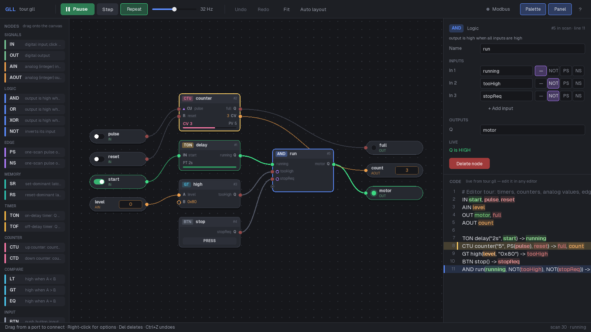

# Gates

A visual logic gate simulator and node editor. Build PLC-style circuits on a canvas or write them in a simple text format (GLL), and watch the signals get evaluated in real time.



[Video demo (V1)](https://youtu.be/DbEJXLR-70E)

## V2: node editor

V2 turns the simulator into a node workflow editor in the spirit of Node-RED / n8n, without giving up the text format:

- **Canvas** with pan, zoom, auto layout and live signal colours on every wire
- **Drag & drop** nodes from the palette, **wire** ports together, right-click for input modifiers (`NOT`, `PS`, `NS`)
- **Inspector** for names, presets, inputs and outputs, with live state
- **Code panel** showing the `.gll` file with live highlighting; selecting a node highlights its line and vice versa
- The **`.gll` file stays the source of truth**: every graph edit is written back as plain GLL, and edits made in any text editor show up instantly (hot reload keeps the running state)
- **Undo / redo**, notes about undriven outputs and dangling signals, a shortcut overlay (`F1`)

See [Node Editor](docs/GLL_Documentation.md#node-editor-v2) for details.

## Language

please refer to [GLL_Documentation.md](docs/GLL_Documentation.md)

## Controls

- **Space** - Run / pause
- **Period (.)** - Step once
- **+/-** - Speed up / slow down
- **Ctrl+Z / Ctrl+Y** - Undo / redo
- **Del** - Delete the selection, **F** - Fit view, **L** - Auto layout
- **Drag from a port** to connect, **right-click** for more
- **Click** the switch on an input to toggle it
- **Click** BTN nodes for a momentary press, **Ctrl+Click** to latch (hold state)
- **F1** - All shortcuts

## Signals

- Green = HIGH (1)
- Red (code panel) / grey (wires) = LOW (0)
- Orange = Analog signal
- Dashed wire = read before it is written in the scan (1-scan delay)

To find out more visit the [GLL_Documentation.md](docs/GLL_Documentation.md)

## Build

Releases are currently Windows only for other Operating systems please build yourself.

Requires SFML 3.x and CMake and the libmodbus library. Either use one of the provided build scripts, or build manually. If you do not want to build GLL from source, visit our [releases](https://github.com/siekwiee/SFML-GLL-Sim/releases) page.

## Run

```bash
./build/Debug/GLLSimulator <Path to your .txt/.gll file>
```

Or drag and drop a .txt/.gll file onto the executable. A path that does not exist yet is created, so `GLLSimulator mycircuit.gll` starts with an empty canvas.

Node positions are saved next to the circuit as `<file>.gll.layout`; the `.gll` itself stays plain GLL.

## Tests

The language core (parser, compiler, editing operations) has a headless test suite that needs no window:

```bash
cmake -S . -B build -DGLL_BUILD_TESTS=ON
cmake --build build --target gll_tests
./build/Debug/gll_tests
```
